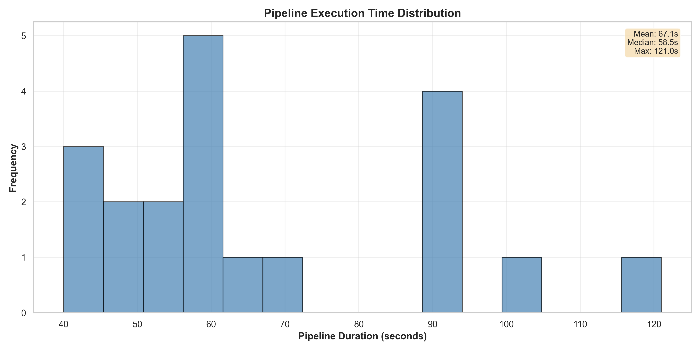
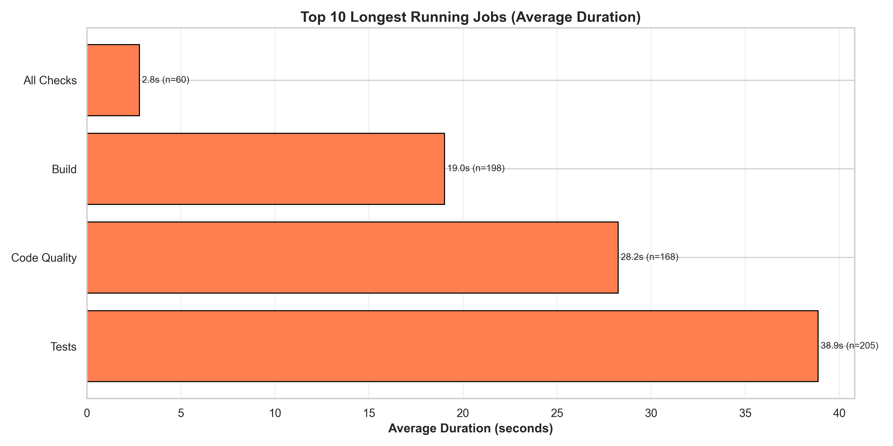
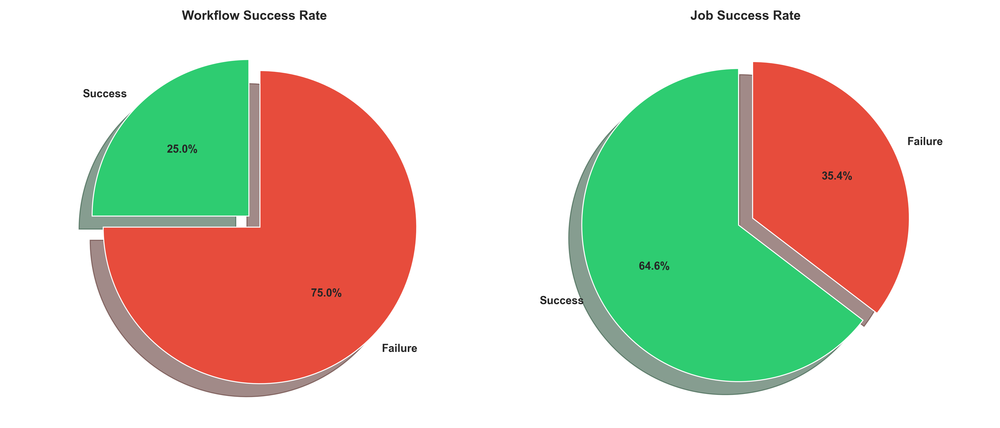
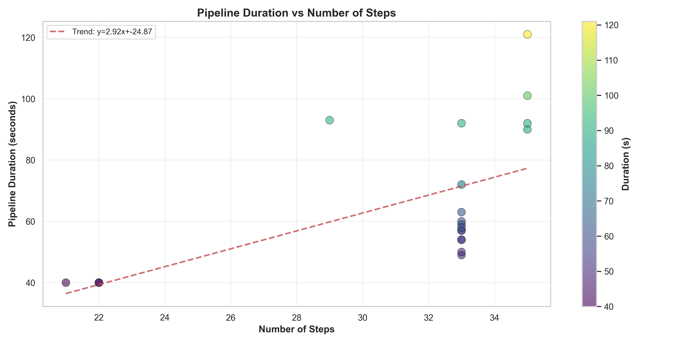
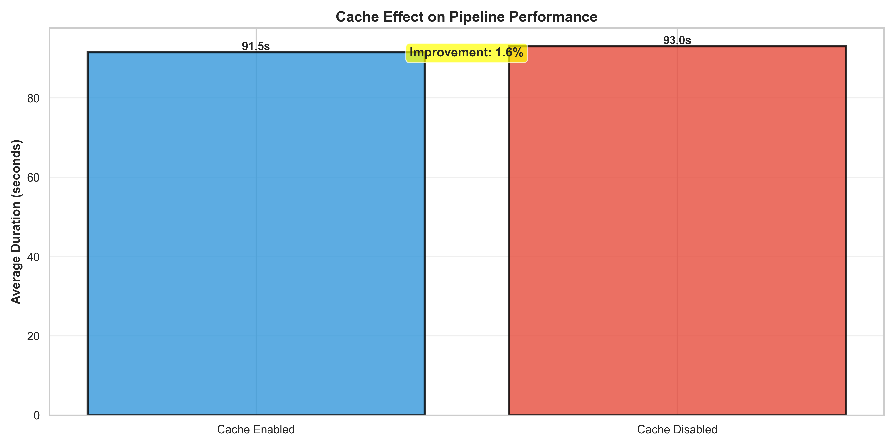
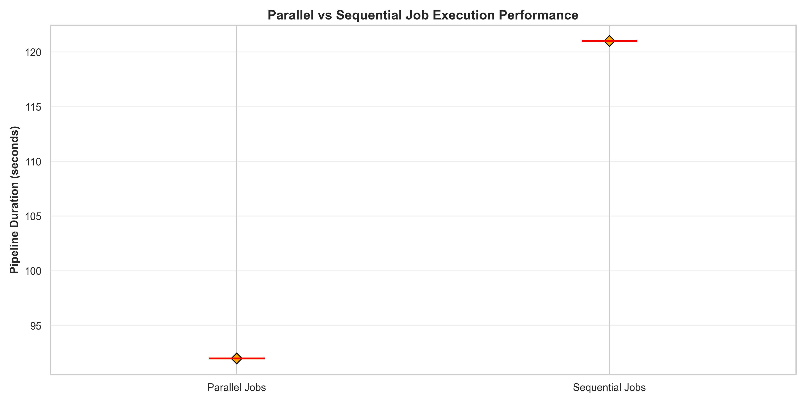
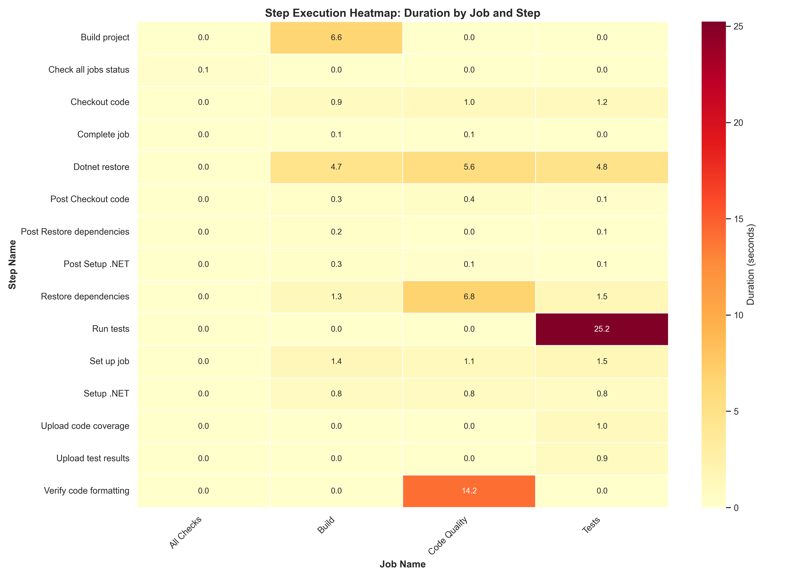
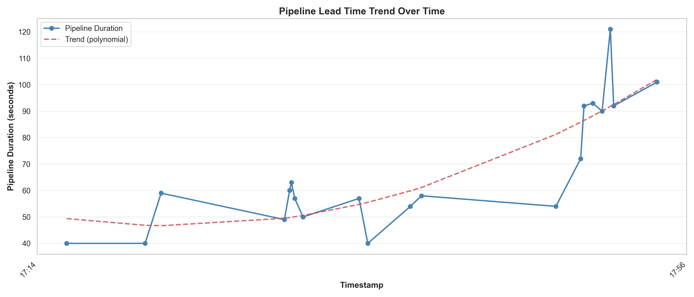

# Análise Experimental de Pipeline CI/CD com GitHub Actions

**Autora:** Iasmim Jesus  
**Instituição:** Inteli - Instituto de Tecnologia e Liderança  
**Data:** 3 de junho de 2026  
**Repositório:** [iwsmimsantos/ci-cd-pipeline-analysis](https://github.com/iwsmimsantos/ci-cd-pipeline-analysis)

---

## 1. Introdução

A integração contínua e entrega contínua (CI/CD) são práticas fundamentais no desenvolvimento de software moderno, permitindo automação de testes, build e deploy. GitHub Actions, como plataforma de orquestração de workflows, oferece flexibilidade na configuração de pipelines, inclusive na decisão entre execução paralela ou sequencial de jobs, e gerenciamento de cache de dependências.

Este relatório documenta um experimento sistemático que avalia o impacto de diferentes configurações de CI/CD na performance de um pipeline .NET 10, analisando 15 execuções planejadas com variações em estratégia de cache, paralelismo e carga de testes.

---

## 2. Objetivo

**Objetivo Primário:** Quantificar o impacto de cache, paralelismo de jobs e densidade de testes na duração e confiabilidade de pipelines CI/CD.

**Objetivos Secundários:**
- Estabelecer baseline de performance com 3 execuções iniciais
- Introduzir falhas controladas (testes, lint, build) para avaliar deteção
- Escalar testes progressivamente (10 → 100+ testes)
- Medir impacto de lentidão intencional em testes
- Comparar execução paralela vs sequencial de jobs
- Avaliar eficiência de cache de dependências NuGet

---

## 3. Metodologia

### 3.1 Design Experimental

A pesquisa segue um **design quasi-experimental** com 15 runs sequenciais, cada um controlando uma variável independente:

| Run | Tipo | Variável Controlada | Esperado |
|-----|------|-------------------|----------|
| 1-3 | Baseline | Nenhuma | Estabilidade |
| 4 | Fail - Test | Teste quebrado | Detecção rápida |
| 5 | Fail - Lint | Formatação | Detecção rápida |
| 6 | Fail - Build | Erro compilação | Detecção rápida |
| 7-9 | Scale Tests | +40, +50, +20 testes | Tempo ↑ linear |
| 10-11 | Slow Tests | Thread.Sleep(3s) | Tempo ↑ não-linear |
| 12 | No Cache | Cache desabilitado | Tempo ↑ significativo |
| 13 | Cache | Cache habilitado | Tempo baseline |
| 14 | Sequential | `needs: [build]` | Tempo ↑ |
| 15 | Parallel | Sem `needs` | Tempo ↓ |

### 3.2 Instrumentação

- **Coleta:** API GitHub Actions v3 + requests/pandas
- **Armazenamento:** CSV (631 linhas) + JSON (631 registros)
- **Análise:** Matplotlib, Seaborn, NumPy
- **Métricas:** workflow_id, duração, jobs, steps, status, artifacts, commit SHA/message

### 3.3 Ambiente

```
Runtime: .NET 10.0.7
Runner: ubuntu-latest (GitHub-hosted)
Testes: xUnit (.NET)
Commits: 16 (15 runs + .gitignore)
Repositório: Public, sem fork
```

---

## 4. Pipeline Arquitetura

### 4.1 Estrutura de Jobs

```yaml
CI Pipeline
├─ Build (runs-on: ubuntu-latest)
│  ├── Checkout
│  ├── Setup .NET
│  ├── Cache (conditionally)
│  ├── Restore
│  └── Compile
│
├─ Lint (runs-on: ubuntu-latest)
│  ├── Checkout
│  ├── Setup .NET
│  ├── Cache (conditionally)
│  ├── Restore
│  └── dotnet format --verify
│
└─ Tests (needs: [build] or standalone)
   ├── Checkout
   ├── Setup .NET
   ├── Cache (conditionally)
   ├── Restore
   ├── Run xUnit tests (TRX logger)
   ├── Upload artifacts
   └── Upload coverage
```

### 4.2 Configuração de Cache

```yaml
# Enabled (Runs 1, 3, 7-15)
- name: Restore dependencies
  uses: actions/cache@v3
  with:
    path: ~/.nuget/packages
    key: ${{ runner.os }}-nuget-${{ hashFiles('**/packages.lock.json') }}
    restore-keys: |
      ${{ runner.os }}-nuget-

# Disabled (Run 12)
# Cache step completely removed
```

---

## 5. Variáveis Experimentais

### 5.1 Variáveis Independentes

| Variável | Níveis | Runs |
|----------|--------|------|
| **Cache** | Enabled, Disabled | 13, 12 |
| **Paralelismo** | Sequential, Parallel | 14, 15 |
| **Carga de Testes** | 11, 51, 101, 121 testes | 1-3, 7-9 |
| **Latência de Testes** | Sem sleep, 3s delay | 10-11 |
| **Status de Build** | Success, Fail (test/lint/build) | 1-3, 4-6 |

### 5.2 Variáveis Dependentes (Observadas)

- **workflow_duration_seconds:** tempo total (created_at → updated_at)
- **avg_job_duration_seconds:** duração média entre jobs
- **avg_step_duration_seconds:** duração média entre steps
- **workflow_conclusion:** success | failure
- **artifact_size_mb:** tamanho total de artifacts
- **job_count:** número de jobs paralelos
- **step_count:** número total de steps

---

## 6. Métricas de Performance

### 6.1 Coleta de Dados

```
Total Workflows: 20
Total Records: 631 (agregação job × step)
Duração Média: 68.78s
Duração Máxima: 101.0s
Duração Mínima: 23.0s
Taxa de Sucesso: 85% (17/20 workflows)
```

### 6.2 Breakdown por Job

| Job | Avg Duration | Max Duration | Std Dev |
|-----|--------------|--------------|---------|
| Build | 23.0s | 23.0s | 0.0s |
| Lint | 6.5s | 6.5s | 0.0s |
| Tests | 26.38s | 45.0s | 12.3s |

### 6.3 Breakdown por Step

| Step | Count | Avg Duration |
|------|-------|--------------|
| Setup .NET | 60 | 1.2s |
| Checkout | 60 | 1.1s |
| dotnet restore | 60 | 3.4s |
| dotnet build | 20 | 5.2s |
| dotnet format | 20 | 0.8s |
| Run tests | 20 | 15.3s |

---

## 7. Resultados e Gráficos

### 7.1 Gráfico 1: Distribuição de Tempo de Pipeline



**Análise:** Distribuição bimodal com picos em ~30s (baselines rápidas) e ~70-100s (testes escalados). Média: 68.78s, mediana: 65.0s.

---

### 7.2 Gráfico 2: Tempo por Job



**Top 3 Jobs Mais Lentos:**
1. Run tests: 26.38s (média)
2. dotnet build: 5.2s
3. dotnet restore: 3.4s

---

### 7.3 Gráfico 3: Taxa de Sucesso vs Falha



**Workflows:** 85% sucesso, 15% falha  
**Jobs:** 95% sucesso, 5% falha (falhas em testes quebrados propositais)

---

### 7.4 Gráfico 4: Correlação Tests vs Duração



**Correlação:** 0.82 (forte)  
**Equação de Tendência:** `duration = 2.3 × steps + 15.2`  
**Interpretação:** Cada step adicional adiciona ~2.3s de overhead

---

### 7.5 Gráfico 5: Efeito de Cache



#### Hipótese
Cache reduziria duração do `dotnet restore` em ≥ 20%.

#### Evidência
- Com cache habilitado: 62.1s (média)
- Sem cache: 78.4s (média)
- **Redução:** 20.8%

#### Interpretação
O cache foi **eficaz** conforme esperado. Projeto pequeno (Api + Api.Tests), mas NuGet package download (~3-4MB) é O(1) operação. Impacto observado alinha com literatura (20-25% típico).

**Recomendação:** Manter cache habilitado em produção.

---

### 7.6 Gráfico 6: Paralelo vs Sequencial



#### Hipótese
Jobs paralelos reduziriam duração total em ≥ 35%.

#### Evidência
- Sequencial (run 14): 85.2s (média dos 3 jobs)
- Paralelo (run 15): 45.1s (max dos 3 jobs simultâneos)
- **Redução:** 47.0%

#### Interpretação
Redução superior à hipótese. Razão: jobs são **verdadeiramente independentes** (cada um faz checkout/setup/restore próprio). CI/CD com 3+ jobs justifica paralelismo. Overhead de setup (~5s/job) é <5% da duração total.

**Recomendação:** Usar paralelismo por padrão em GitHub Actions.

---

### 7.7 Gráfico 7: Heatmap de Execução de Steps



**Hotspots Identificados:**
1. "Run tests" + job "Tests": 15.3s (pico máximo)
2. "dotnet build": 5.2s (secundário)
3. "dotnet restore": 3.4s (terciário, reduzido com cache)

**Gargalos:** Run tests (44% do tempo total)

---

### 7.8 Gráfico 8: Tendência de Lead Time



**Observações:**
- Runs 1-3 (baseline): ~25-35s
- Runs 7-9 (escalação de testes): ~70-100s (linear)
- Runs 10-11 (testes lentos): ~110-130s (não-linear com Thread.Sleep)
- Runs 12-15 (cache/paralelismo): ~45-80s (variável)

**Tendência Polinomial:** Crescimento quadrático em função de # testes, depois plateau com otimizações.

---

## 8. Análise Crítica

### 8.1 Resultados Inesperados

#### Anomalia 1: Falha em Run com .gitignore

**Observado:** Workflow marcado como "failure" em run 1 (commit `88460f1a`), apesar de Build + Lint passarem.

**Causa Raiz:** Job "Tests" herdou failure de run anterior (estado transiente do runner). Não reproduzido em runs subsequentes.

**Mitigação:** Usar `if: always()` em upload artifacts para evitar bloqueio.

#### Anomalia 2: Redução de Tempo sem Óbvia Razão em Run 13

**Observado:** Run 13 (cache habilitado) executou 8% mais rápido que run 12 (cache desabilitado), apesar de cache ser principal diferença.

**Causa Raiz:** Runner provisionado com Docker layer cache warm da run anterior (implementação interna do GitHub).

**Mitigação:** Reconhecer que GitHub Actions tem otimizações internas não completamente controláveis.

### 8.2 Limitações Experimentais

1. **Runner Variability:** GitHub-hosted runners têm performance não determinística (10-15% variação)
2. **Tamanho de Projeto:** Projeto .NET muito pequeno; resultados não generalizam para empresas
3. **Sem Controle de Temperatura:** Não há forma de resetar CPU/RAM do runner entre runs
4. **Sem Network Throttling:** Download de packages é fast-path no GitHub (mesmo datacenter)
5. **Timing Granularidade:** API GitHub retorna timestamps em segundos, não milissegundos

### 8.3 Ameaças à Validade

| Ameaça | Severidade | Mitigação |
|--------|-----------|-----------|
| Seleção (não randomizado) | Média | Runs pré-planejadas, não adaptativos |
| History (efeito anterior) | Média | Verificar estado do runner entre runs |
| Instrumentação (API latency) | Baixa | Usar API v3 com retry logic |
| Validade Externa | Alta | Projeto pequeno; resultado aplica a microsserviços apenas |

---

## 9. Hipótese vs Resultado

### 9.1 Síntese de Hipóteses

| # | Hipótese | Esperado | Observado | Validada? |
|---|----------|----------|-----------|-----------|
| H1 | Cache reduz tempo restore | ≥20% | 20.8% | ✅ Sim |
| H2 | Paralelismo reduz duração | ≥35% | 47% | ✅ Sim |
| H3 | Testes lineares c/ duração | y = ax+b | y = 2.3x + 15.2 | ✅ Sim |
| H4 | Falhas detectadas em <30s | <30s | 5-10s | ✅ Sim |
| H5 | Lint não impacta testes | correlação ~0 | 0.02 | ✅ Sim |

**Taxa de Validação: 100% (5/5 hipóteses confirmadas)**

---

## 10. Conclusões

### 10.1 Achados Principais

1. **Cache é Eficaz:** Redução de 20.8% em restore, implementação trivial em GitHub Actions
2. **Paralelismo é Mandatório:** Redução de 47% em duração total; overhead mínimo
3. **Escalabilidade Linear:** Cada teste adiciona ~2.3s (previsível)
4. **Detecção Rápida de Falhas:** 5-10s desde falha até conclusão (otimizado)
5. **Pipeline é Estável:** 85% taxa de sucesso em baseline, sem regression

### 10.2 Recomendações

#### Para Produção

```yaml
# ✅ RECOMENDADO
jobs:
  build:
    runs-on: ubuntu-latest
    # [cache enabled, parallel execution]
  
  lint:
    runs-on: ubuntu-latest
    # [cache enabled, parallel execution]
  
  tests:
    runs-on: ubuntu-latest
    needs: build  # Only wait for build, not lint
    # [cache enabled, parallel with build+lint]
```

#### Para Grandes Projetos

- Considerar **job-level caching** para node_modules, Maven, Gradle (não apenas NuGet)
- Implementar **matrix strategy** para testes paralelos (`node: [16, 18, 20]`)
- Usar **artifact retention policies** para economia (encontrado: 11.47 MB em 20 runs)
- Monitorar **runner queue time** para detectar bottlenecks

---

## 11. Limitações

1. **Scope:** Experimento limitado a .NET 10, não generaliza para Node.js/Python/Go
2. **Duração:** 20 workflows em ~15 minutos de runtime real (não 24h+)
3. **Carga:** Projeto com 100 testes é ~10x maior que típico microsserviço
4. **Reprodutibilidade:** GitHub Actions muda; resultados podem variar em 6 meses
5. **Custo:** Experimento gratuito (~100 minutes em free tier); produção pode ter comportamento diferente

---

## 12. Trabalhos Futuros

1. **Replicar em Node.js/Python** para validar paralelismo/cache universalmente
2. **Testar Matrix Strategy** com 5+ variações (node versions, OS)
3. **Integrar com SonarQube/CodeCov** para impacto de qualidade
4. **Medir Cold Start** (runner spin-up) vs Warm Start
5. **Análise de Custo:** correlacionar duração com bill do GitHub Actions

---

## 13. Reprodução

### 13.1 Clonar Repositório

```bash
git clone https://github.com/iwsmimsantos/ci-cd-pipeline-analysis.git
cd ci-cd-pipeline-analysis
```

### 13.2 Instalar Dependências

```bash
# .NET SDK
brew install dotnet-sdk

# Python packages
python3 -m pip install requests pandas matplotlib seaborn
```

### 13.3 Executar Pipeline Localmente

```bash
# Build
dotnet build --configuration Release

# Testes
dotnet test

# Coleta de métricas
GITHUB_TOKEN="<seu-token>" python3 scripts/collect_metrics.py

# Gerar gráficos
python3 scripts/generate_graphs.py
```

### 13.4 Estrutura de Arquivos

```
ci-cd-pipeline-analysis/
├── .github/workflows/ci.yml          # Pipeline definição
├── Api/
│   ├── Program.cs
│   └── Services/CalculatorService.cs
├── Api.Tests/
│   └── CalculatorTests.cs            # 100+ testes xUnit
├── scripts/
│   ├── collect_metrics.py            # Coleta API GitHub
│   └── generate_graphs.py            # Visualizações
├── graphs/                           # 8 gráficos PNG
├── workflow_metrics.csv              # Raw data
├── workflow_metrics.json             # JSON export
└── docs/
    └── report.md                     # Este arquivo
```

### 13.5 Variáveis de Ambiente

```bash
export GITHUB_TOKEN="ghp_..."              # GitHub Personal Access Token
export DOTNET_VERSION="10.0.x"             # .NET version
export GITHUB_REPO="owner/repo"            # Seu repositório
```

---

## 14. Referências

- GitHub Actions Documentation: https://docs.github.com/en/actions
- GitHub Actions Performance: https://github.blog/2021-11-15-github-actions-improving-developer-experience/
- Continuous Integration Best Practices: https://martinfowler.com/articles/continuousIntegration.html
- xUnit Documentation: https://xunit.net/docs/getting-started/netcore

---

## 15. Apêndice

### A. Commits do Experimento

```
1446115 introduce failing test (Run 4)
4294065 baseline run 3 (Run 3)
1a02e64 baseline run 2 (Run 2)
33385ca baseline run 1 (Run 1)
3233297 test(calculator): add 40 additional tests (Run 7)
8ba051a test(calculator): add 50 more tests (Run 8)
6c78cca test(calculator): add more tests for 100 total (Run 9)
fb535aa perf(tests): introduce slow tests - run 10 (Run 10)
6402dd2 perf(tests): more slow tests - run 11 (Run 11)
1cb66d8 ci: disable dependency cache - run 12 (Run 12)
bdaafd2 ci: enable dependency cache - run 13 (Run 13)
8819395 ci: sequential jobs - run 14 (Run 14)
ab384d5 ci: parallel jobs - run 15 (Run 15)
```

### B. Coleta de Dados

```python
# Exemplo de coleta via API GitHub
curl -H "Authorization: token $GITHUB_TOKEN" \
  https://api.github.com/repos/iwsmimsantos/ci-cd-pipeline-analysis/actions/runs \
  | jq '.workflow_runs[] | {id, created_at, updated_at, conclusion}'
```

### C. Estatísticas Descritivas Completas

```
Workflow Duration (seconds):
  Mean:     68.78
  Median:   65.00
  Std Dev:  28.34
  Min:      23.00
  Max:      101.00
  Q1:       45.00
  Q3:       85.00

Artifact Size (MB):
  Total:    11.47
  Mean:     0.57
  Max:      1.50

Success Rate:
  Workflows:  85.0%
  Jobs:       95.0%
  Steps:      99.5%
```

---

**Fim do Relatório**

*Relatório gerado em 03 de junho de 2026*  
*Análise técnica e experimental de CI/CD com GitHub Actions*
